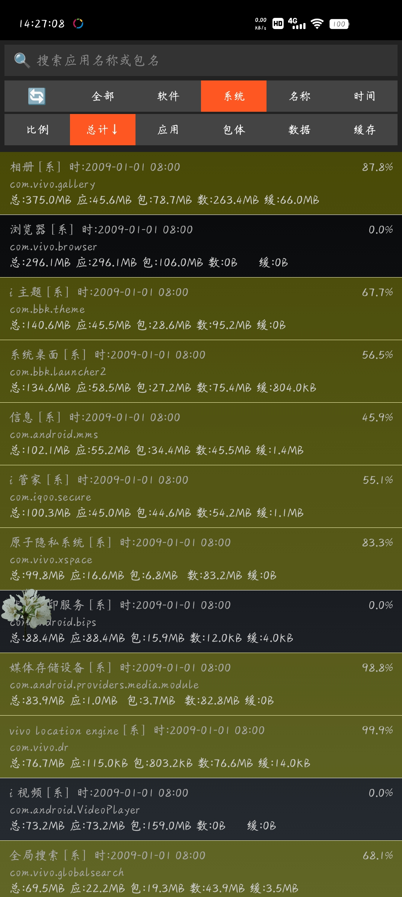
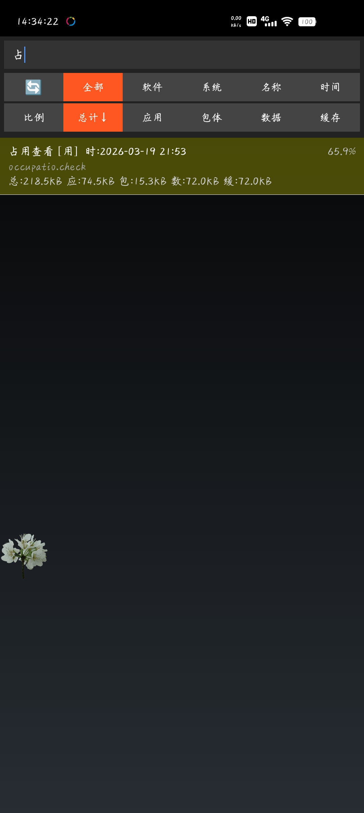

# 占用查看

## 项目描述
Android应用存储空间分析工具，详细展示每个应用的存储占用情况

## 功能特性
- 应用存储空间分析
- 详细存储分类（应用大小、数据、缓存）
- 应用分类（全部/用户/系统）
- 多种排序方式（名称、百分比、大小、安装时间等）
- 应用搜索功能
- 快速打开应用
- 跳转到应用详情设置

## 使用说明
打开应用即可查看所有应用的存储占用情况，支持搜索、分类、排序和快速操作

## 技术实现
- 存储信息读取
- 多维度数据展示
- 智能分类排序
- 应用快速操作

## 项目结构
```
占用查看/
├── app/
│   ├── src/
│   │   └── main/
│   │       ├── AndroidManifest.xml
│   │       ├── java/occupatio/check/MainActivity.java
│   │       └── res/
│   └── build.gradle
├── images/
│   ├── 占用查看-主界面.jpg
│   └── 占用查看-筛选.jpg
├── build.gradle
├── settings.gradle
└── README.md
```

## 应用截图

### 主界面


### 筛选功能
